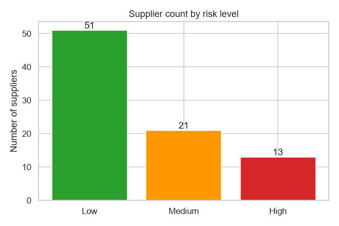
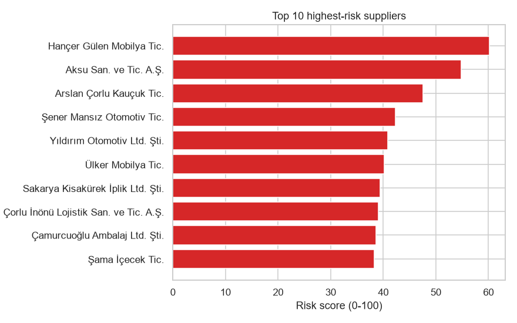
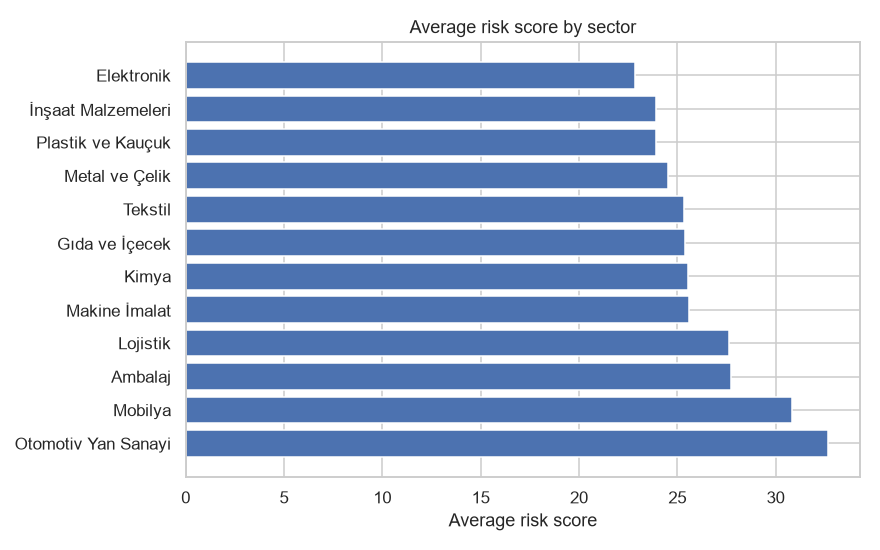
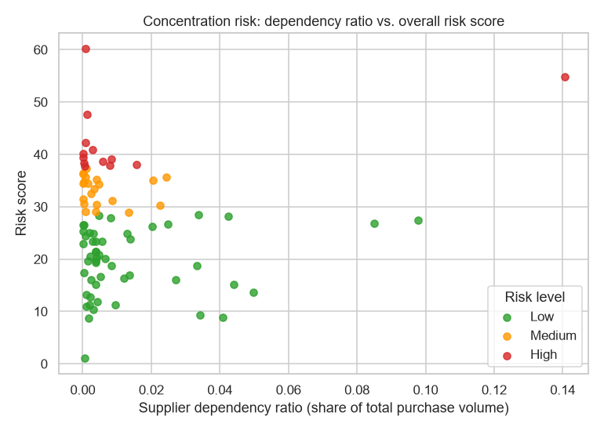

# Supplier Risk & Performance Scoring

A sector-independent (non-defense) supply chain analytics project. Synthetic Turkish
supplier data is generated, cleaned through a **profile-driven, source-agnostic cleaning
engine**, and scored on **two independent risk axes** — operational/performance risk and
financial/solvency risk — each a 0-100 score with a Low/Medium/High label, plus
portfolio-level concentration risk (HHI) and qualitative due-diligence red flags —
visualized in a Power BI dashboard.

This started as a v1 proof of concept and has since been rebuilt (v2) around a genuine
reusability question: what would it actually take to adapt this to a *different* company's
ERP export, not just this project's own synthetic data? See
[Adapting this to your own company's data](#adapting-this-to-your-own-companys-data) and
[docs/research_v2.md](docs/research_v2.md) (Turkey-grounded research behind every v2
design decision) for the honest answer.




## Motivation

I have a Business Administration and Economics background, not an engineering one. But
through the experience I gained at defense industry companies and the reading I've done,
I kept noticing the same gap in procurement and supply chain work: reliable, clean
supplier data. This project is a self-designed, end-to-end attempt at the kind of tool
that observation pointed toward: turning messy, real-world-style supplier data into a
risk score that can actually be explained and defended, not just computed.

## Pipeline

```
generate_suppliers.py  →  clean_suppliers.py         →  score_suppliers.py         →  Power BI
(synthetic messy data)    (profile-driven cleaning)     (two independent            (dashboard)
                                                          risk axes + HHI)
```

1. **Data generation** (`src/generate_suppliers.py`) — builds 85 synthetic suppliers for a
   Turkish SME/large-industry context, with realistic company names, sectors, provinces,
   real VKN tax-ID numbers, and KOSGEB-aligned company-size tiers (Micro/Small/Medium/Large).
   The raw output is *intentionally* messy: mixed date formats, mixed decimal separators
   (Turkish `1.234,56` vs plain `1234.56`), inconsistent/bilingual category labels, missing
   cells — the kind of mess a real multi-source Excel export actually has.
2. **Cleaning** (`src/clean_suppliers.py` + `src/cleaning/`) — a generic engine
   (`src/cleaning/engine.py`) with zero source-specific knowledge, driven entirely by a
   declarative YAML **profile** (`config/erp_profiles/synthetic_generator.yaml` for this
   dataset — see [Adapting this to your own company's data](#adapting-this-to-your-own-companys-data)).
   Every column rule — number/date parsing, category label mapping, closed-list restoration —
   lives in the profile, validated by a Pydantic schema, not hardcoded per source. See
   [Notable design decisions](#notable-design-decisions) below for the genuine bugs this surfaced.
3. **Scoring** (`src/score_suppliers.py`) — computes two **independent** risk axes,
   deliberately not blended into one number: `risk_score` (operational/performance:
   delivery, price volatility, concentration, quality) and `financial_risk_score`
   (financial/solvency: overdue debt, leverage, payment defaults). Also computes
   portfolio-wide concentration risk via the Herfindahl-Hirschman Index (HHI). See
   [Scoring methodology](#scoring-methodology) below.
4. **Dashboard** (`reports/supplier_risk_dashboard.pbix`) — Power BI report built on
   `reports/supplier_risk_scores.csv`.

## Scoring methodology

### Operational risk axis (`risk_score`)

| Criterion | What it measures | Default weight |
|---|---|---|
| Delivery delay rate | Share of orders delivered late | 35% |
| Price volatility | Coefficient of variation of quarterly unit price | 25% |
| Supplier dependency ratio | This supplier's share of total purchase volume (concentration risk) | 25% |
| Quality / return rate | Share of shipped units returned | 15% |

These four categories mirror standard supplier-scorecard practice (OTIF delivery
performance, purchase-price variance, supplier concentration risk as used in Peter
Kraljic's 1983 supplier-segmentation framework, and PPM defect/return rate) rather than
being invented for this project. The specific **weights are a configurable default**, not
a fixed industry rule — real companies calibrate weights to their own priorities, and so
can anyone reusing this project, by editing `config/scoring_weights.yaml` (validated to
always sum to 100%).

References for the underlying framework:
- Kraljic, P. (1983). ["Purchasing Must Become Supply Management"](https://hbr.org/1983/09/purchasing-must-become-supply-management), *Harvard Business Review*.
- [Supplier Scorecard: Definition, KPIs, and implementation in procurement](https://www.tacto.ai/en/procurement-glossary/supplier-scorecard) — Tacto
- [Supplier Risk Scorecard: How to Build One That Works](https://www.atlassystems.com/blog/supplier-risk-scorecard) — Atlas Systems
- [Vendor Scorecards: Complete Guide For Procurement Teams](https://www.ivalua.com/blog/vendor-scorecard/) — Ivalua
- [The Kraljic Matrix: A Procurement Leader's Guide](https://business.amazon.com/en/blog/kraljic-matrix) — Amazon Business
- U.S. Department of Justice / FTC, [Herfindahl-Hirschman Index](https://www.justice.gov/atr/herfindahl-hirschman-index) — the concentration metric behind the portfolio HHI
- KOSGEB, [KOBİ Tanımı (SME Definition)](https://www.kosgeb.gov.tr/) — Turkey's official company-size classification used for `company_size`
- Findeks (KKB), [Ticari Risk Raporu](https://www.findeks.com/) — the commercial credit-bureau product `financial_risk_score` is conceptually inspired by

**Why these specific default weights?** Delivery delay is weighted highest (35%) because a
late delivery stops production or sales immediately — usually the most operationally urgent
risk. Price volatility and supplier dependency ratio (25% each) are both financial/strategic
risks, weighted equally by default. Quality/return rate is weighted lowest (15%) because
quality issues are typically caught and corrected faster than a missed delivery. None of
this is a fixed rule — it's the starting rationale documented in
`config/scoring_weights.yaml`, meant to be adjusted (e.g. a price-sensitive retail business
would raise price volatility; a business with many single-sourced critical parts would raise
supplier dependency ratio).

Risk level (Low/Medium/High) is assigned by **percentile**, not a fixed score cutoff: the
riskiest ~15% and safest ~60% of the *current* supplier population, also configurable. A
fixed cutoff was tried first and produced zero High-risk suppliers — combining four
independently normalized metrics regresses combined scores toward the middle, so a fixed
absolute threshold can simply never be reached.

**Concentration risk is HHI-inspired:** `supplier_dependency_ratio_score` normalizes on
each supplier's *squared* share of total volume, not the linear share, so a supplier at
20% of spend is penalized disproportionately more than four suppliers at 5% each — the
same logic behind the real Herfindahl-Hirschman Index (see below). The displayed
`supplier_dependency_ratio` column itself stays the plain, human-readable share.

### Financial risk axis (`financial_risk_score`)

A second, **independent** 0-100 score — deliberately not blended into `risk_score`, since
a supplier can be operationally excellent but financially fragile, or vice versa, and
merging both into one number would hide which kind of risk is actually driving a rating.
Real commercial platforms (e.g. SAP Ariba) keep financial, compliance, and sustainability
risk as separate facets for the same reason.

| Signal | What it measures | Weight |
|---|---|---|
| Overdue debt ratio | Share of payables past due | 30% |
| Debt-to-revenue ratio | Leverage relative to revenue | 30% |
| Payment default (last 3 years) | Binary: has this supplier defaulted before | 40% |

Conceptually inspired by what a real **Findeks Ticari Risk Raporu** (Turkey's actual
commercial credit bureau product) covers — *not* a reproduction of KKB's actual
proprietary scoring formula, which isn't publicly published.

### Portfolio concentration (HHI)

`compute_portfolio_hhi()` computes the **Herfindahl-Hirschman Index** — a real, standard
economics concentration metric (the sum of each supplier's squared share of total spend,
scaled to the conventional 0-10,000 range) used by the US DOJ for antitrust review, applied
here to procurement concentration: <1,500 = low concentration, 1,500-2,500 = moderate,
>2,500 = high. This is a portfolio-level summary statistic, independent of any single
supplier's score.

### Due-diligence red flags

Three qualitative, binary signals — `has_export_documentation`, `requires_full_upfront_payment`,
`site_visit_verified` — sourced from a real Turkish sourcing consultant's supplier-vetting
checklist (see `docs/research_v2.md`), not derived from a formula and not blended into
either risk score. Included as an explicit example that a purely numeric scorecard misses
signals a real due-diligence process would catch.

## Project structure

```
config/
  scoring_weights.yaml        # editable risk weights + risk-level thresholds
  erp_profiles/                # YAML cleaning profiles (one per data source)
    synthetic_generator.yaml   # profile for this project's own synthetic data
    sap_export_example.yaml    # illustrative SAP-style profile (NOT verified against a real export)
    logo_netsis_export_example.yaml  # illustrative Logo/Netsis-style profile (same caveat)
data/
  raw/                   # synthetic, intentionally messy generated data
  processed/             # cleaned, standardized data used for scoring
src/
  generate_suppliers.py  # synthetic data generator
  clean_suppliers.py     # thin CLI wrapper around the cleaning engine + VKN validation
  cleaning/               # the reusable, source-agnostic cleaning engine
    engine.py             # clean_with_profile() — zero source-specific knowledge
    profile.py            # Pydantic schema every profile is validated against
    text_utils.py          # parsing/matching helpers used by the engine
    vkn.py                 # Turkish tax-ID (VKN) checksum validation
    ai_profile_assist.py   # builds a schema-constrained AI prompt to draft new profiles
  ai_draft_profile.py    # CLI for AI-assisted profile drafting
  score_suppliers.py     # risk scoring engine (both axes + HHI)
notebooks/
  supplier_risk_analysis.ipynb   # step-by-step walkthrough with charts
reports/
  supplier_risk_scores.csv       # scored output (Power BI data source)
  supplier_risk_dashboard.pbix   # Power BI dashboard
  dax_measures.txt               # reference DAX measures used in the dashboard
docs/
  research_v2.md           # Turkey-grounded research behind every v2 design decision
  images/                  # chart exports used in this README
tests/                    # 79 tests covering the cleaning engine, scoring, and VKN logic
```

## Setup

```bash
python -m venv venv
venv\Scripts\activate
pip install -r requirements.txt
```

## Running the pipeline

```bash
python src/generate_suppliers.py   # -> data/raw/suppliers_raw.csv
python src/clean_suppliers.py      # -> data/processed/suppliers_clean.csv (uses config/erp_profiles/synthetic_generator.yaml by default)
python src/score_suppliers.py      # -> reports/supplier_risk_scores.csv
```

`clean_suppliers.py` accepts `--profile`, `--input`, and `--output` to run against a
different YAML profile (see [Adapting this to your own company's data](#adapting-this-to-your-own-companys-data)).

Generation uses a fixed random seed (42), so re-running the pipeline reproduces the same
85 suppliers and the same scores every time.

Then open `notebooks/supplier_risk_analysis.ipynb` (kernel: "Python (supplier-risk-scoring)")
for the full walkthrough with charts, or open `reports/supplier_risk_dashboard.pbix` in
Power BI Desktop for the dashboard.

## Dashboard

Three pages: **Overview** (KPI cards, risk-level distribution, top 10 riskiest suppliers),
**Sector & Geography** (average risk by sector / city / company size), and **Supplier
Detail** (slicers, a full detail table, top 10 by supplier concentration).




**v2 note:** the DAX measures for the financial risk axis and portfolio HHI are written and
ready in `reports/dax_measures.txt`, but the `.pbix` file itself (a binary Power BI format)
still needs to be opened in Power BI Desktop to refresh its data source against the new
`reports/supplier_risk_scores.csv` columns and add visuals for them — that's a manual step,
not something scriptable from here.

## Notable design decisions

- **Faker's `tr_TR` locale isn't safe to use directly for this dataset.** Its `company()`
  provider ships ~100 hardcoded *real* Turkish companies (from a Capital 500 list) — using
  it would put real company names into a synthetic dataset. Company names are instead built
  from generic surnames + sector keywords + legal suffixes (Ltd. Şti. / A.Ş. / Holding A.Ş.),
  scaled to company size. Its `city()`/`address()` providers also have no real Turkish data
  and fall back to broken English-style placeholders — real province names are used instead.
- **A genuine Unicode bug:** Python's locale-unaware `str.lower()` turns `'İ'` into `'i'`
  plus an invisible combining-dot character (U+0307) instead of a plain `'i'`, which silently
  broke category matching during cleaning until explicitly stripped.
- **A genuine Power BI import bug:** without an explicit locale, Power BI parsed this
  project's period-decimal CSV numbers using the (Turkish) system locale's comma-decimal
  convention, inflating every numeric column by 10x–10,000x. Fixed in Power Query by
  re-typing the raw text columns with an explicit `en-US` locale — a fix that's portable
  regardless of which machine's regional settings opens the file next.
- **`pd.cut` raises on duplicate bin edges**, which happens whenever the low/high percentile
  cutoffs for a risk level land on the same score — a real, reproducible edge case on small
  or heavily-tied populations (found while testing `financial_risk_score` against a 3-row
  toy dataset). `assign_risk_level()` detects this and falls back to a simple Low/High split
  instead of crashing.
- **Pydantic's `dict[str, str]` rejects booleans**, which broke the `iso_certified` /
  `payment_default_last_3y` category maps until the schema was loosened to
  `dict[str, Union[str, bool]]` — category maps needed to express both string-to-string and
  string-to-boolean normalization.

## Limitations & possible extensions

Documented here deliberately, rather than left implicit:

- **Supplier dependency ratio is computed against total portfolio spend**, not per
  product/commodity category. A supplier that's 12% of *all* purchasing looks riskier than
  one that's 60% of a single, less-critical category — in a real deployment, computing this
  per category would usually be more decision-useful. The same applies to the portfolio HHI.
- **Price volatility is based on 4 quarterly price points per supplier** — enough to
  illustrate the method, but a small sample for a real volatility estimate; more frequent
  price history would make this metric more robust.
- **Missing raw inputs are median-imputed**, and every supplier with at least one imputed
  value is flagged in `has_estimated_inputs` / `financial_risk_has_estimated_inputs` rather
  than silently treated as equally reliable — but the imputation itself is a simplification;
  a real deployment might instead exclude those suppliers from ranking or impute by
  sector/segment.
- **The scoring method (min-max normalization + weighted sum) is a simple, standard
  multi-criteria approach** — transparent and easy to explain, which matters for a risk
  score people need to trust, but more advanced weighting methods (e.g. AHP, entropy
  weighting) exist and could replace it without changing the rest of the pipeline.
- **`financial_risk_score` is conceptually inspired by, not a reproduction of, a real
  Findeks/KKB report** — KKB's actual proprietary scoring formula isn't publicly published,
  so the weighting (30/30/40) is this project's own reasonable default, not a verified
  industry figure.
- **The due-diligence red flags are generated from a size-tiered probability, not real
  vetting outcomes** — they illustrate that a scorecard should have room for qualitative
  signals, not a claim that this specific probability model matches reality.
- **This has not been validated against real outcomes** — the data is synthetic by design,
  so there's no ground truth to check the score against (e.g. "did High-risk suppliers
  actually cause more disruptions"). That validation is exactly what a real deployment
  would need before being trusted operationally.

## Adapting this to your own company's data

This is the question v2 was built around, and the honest answer is: **closer than v1, but
still not zero-config** — no tool can guess a company's exact column meanings, date
formats, and label spellings from nothing.

**The scoring engine (`src/score_suppliers.py`) is fully reusable as-is**: if your data has
the same column names as `data/processed/suppliers_clean.csv`, you can run it directly, and
the weights in `config/scoring_weights.yaml` are meant to be edited without touching any code.

**The cleaning step is now profile-driven, not a rewrite.** In v1, adapting the cleaner to a
new source meant editing `clean_suppliers.py` itself. In v2, `src/cleaning/engine.py` has
*zero* source-specific knowledge — every rule (column renaming, date formats, category
label variants, numeric decimal style, closed lists) lives in a YAML **profile**, validated
against a Pydantic schema (`src/cleaning/profile.py`) before it's trusted. Adapting to a new
ERP export means:

1. Writing a new profile (`config/erp_profiles/your_company.yaml`) — see
   `config/erp_profiles/sap_export_example.yaml` for a template using real SAP LFA1 field
   codes. **This example profile is illustrative, not verified against a real SAP export**
   — it demonstrates the *shape* a real profile would take, not a tested integration.
2. Running `python src/clean_suppliers.py --profile config/erp_profiles/your_company.yaml --input your_export.csv`.

**AI-assisted profile drafting** (`src/ai_draft_profile.py`) can speed up step 1: it builds a
prompt from a sample of your raw data plus the profile's own JSON schema, asks Claude to
draft a first-pass profile, then validates the response against that schema before writing
anything — a malformed or hallucinated draft is rejected, not silently trusted. AI is used
here only to accelerate *drafting a config file that gets validated*, never to make or
influence an actual risk-scoring decision — the scoring logic itself has no AI in it. This
was a deliberate boundary: black-box interpretability is a documented, unresolved adoption
barrier for commercial supplier-risk tools (see `docs/research_v2.md`), and a risk score
someone can't explain is a risk score no one will trust.

## Status

**v2 complete:** profile-driven cleaning engine, KOSGEB-aligned company sizing, VKN
validation, HHI-based concentration risk, AI-assisted profile drafting, a separate
financial risk axis, due-diligence red flags — all reflected in the data generation,
cleaning, scoring, and notebook. The DAX measures for the new axes are written
(`reports/dax_measures.txt`); adding them to the `.pbix` itself is a manual Power BI
Desktop step, not yet done (see [Dashboard](#dashboard)).

**Open, tracked in `docs/research_v2.md`:** AHP-derived weights (replacing asserted
weights with a consistency-checked method), risk-score trend over time, a geopolitical/
country risk factor, per-sector HHI, and real (verified-against-an-actual-export) Logo/
Netsis and SAP profile support — the two example ERP profiles in this repo are
illustrative templates, not tested integrations.
